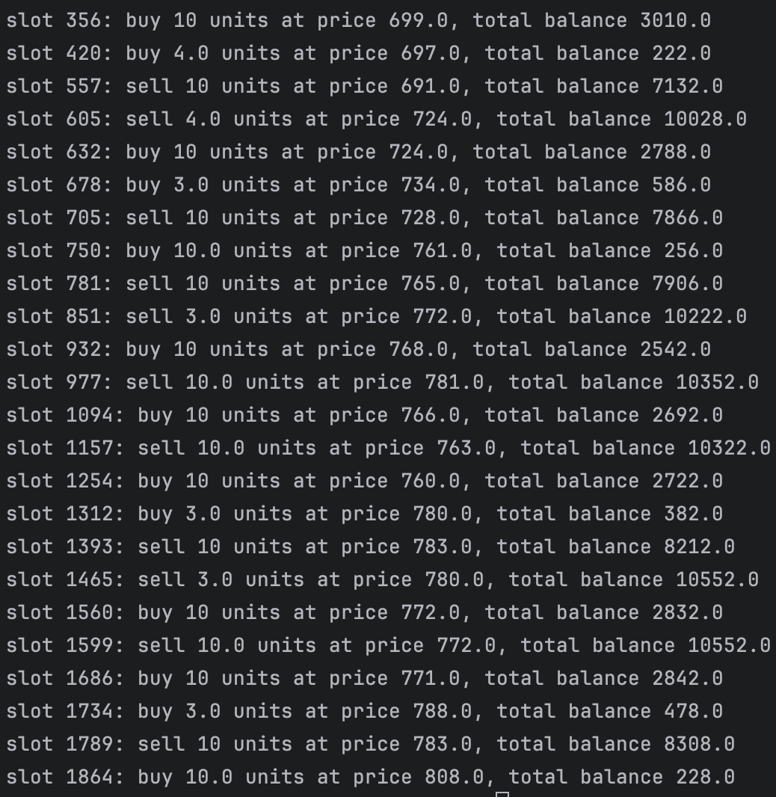
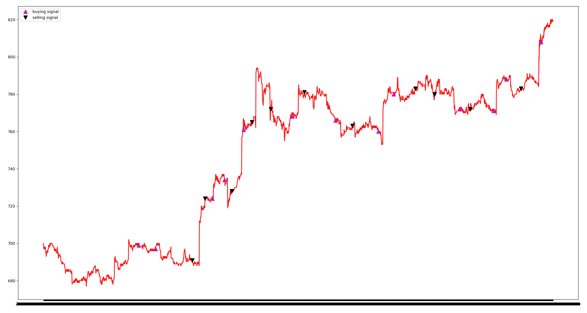
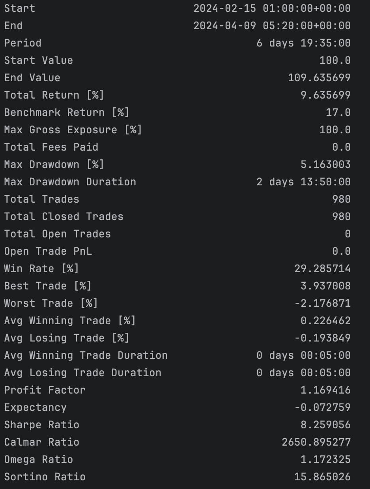
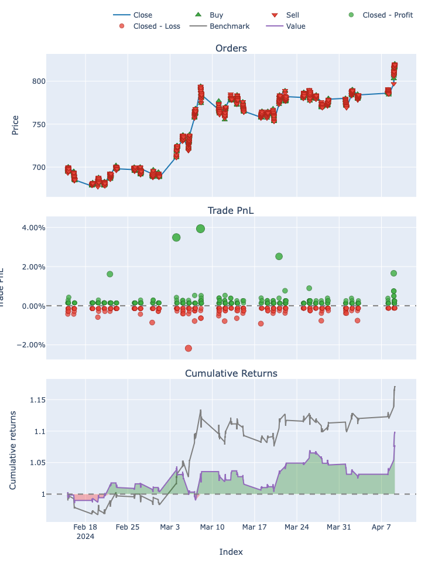

# TW Stocker

每天更新的台股歷史資料庫，計算技術指標，回測然後推薦股票。  

https://voidful.github.io/tw_stocker/stock_report.html

## 使用方式，以2330為例，可以換成自己需要的股票

```python
import pandas as pd

url="https://raw.githubusercontent.com/voidful/tw_stocker/main/data/2330.csv"
pd.read_csv(url)
```

## 資料來源
Yahoo finance，每隔5分鐘的六十天內資料，會用github action持續更新。

## 抽取技術指標
1. `pip install fta`
2. 
```python
import pandas as pd
import fta
url = "https://raw.githubusercontent.com/voidful/tw_stocker/main/data/2330.csv"
df = pd.read_csv(url, index_col='Datetime')

ta = fta.TA_Features()
df_full = ta.get_all_indicators(df)
print(df_full)
```

## 模擬交易
1. git clone this project  
2. 參考`strategy/dynamic_delay`作為我們交易的策略  
```python
import pandas as pd
import fta
from strategy.dynamic_delay import trade

url = "https://raw.githubusercontent.com/voidful/tw_stocker/main/data/2330.csv"
df = pd.read_csv(url, index_col='Datetime')


ta = fta.TA_Features()
df_full = ta.get_all_indicators(df)

PARAMETER = {
    "delay": 15,
    "initial_money": 10000,
    "max_buy": 10,
    "max_sell": 10,
}

states_buy, states_sell, states_entry, states_exit, total_gains, invest = trade(df_full, **PARAMETER)
```
#### 結果


### 交易圖表
```python
from matplotlib import pyplot as plt
import pandas as pd
import fta
from strategy.dynamic_delay import trade

url = "https://raw.githubusercontent.com/voidful/tw_stocker/main/data/2330.csv"
df = pd.read_csv(url, index_col='Datetime')


ta = fta.TA_Features()
df_full = ta.get_all_indicators(df)

PARAMETER = {
    "delay": 15,
    "initial_money": 10000,
    "max_buy": 10,
    "max_sell": 10,
}

states_buy, states_sell, states_entry, states_exit, total_gains, invest = trade(df_full, **PARAMETER)

close = df_full['close']
fig = plt.figure(figsize = (15,5))
plt.plot(close, color='r', lw=2.)
plt.plot(close, '^', markersize=10, color='m', label = 'buying signal', markevery = states_buy)
plt.plot(close, 'v', markersize=10, color='k', label = 'selling signal', markevery = states_sell)
plt.legend()
plt.show()
```
#### 結果


### 回測
```python
import vectorbt as vbt
import pandas as pd
import numpy as np
import fta
from strategy.dynamic_delay import trade

url = "https://raw.githubusercontent.com/voidful/tw_stocker/main/data/2330.csv"
df = pd.read_csv(url, index_col='Datetime')


ta = fta.TA_Features()
df_full = ta.get_all_indicators(df)

PARAMETER = {
    "delay": 15,
    "initial_money": 10000,
    "max_buy": 10,
    "max_sell": 10,
}

states_buy, states_sell, states_entry, states_exit, total_gains, invest = trade(df_full, **PARAMETER)

fees = 0 # 假設交易費用為 0
portfolio_kwargs = dict(size=np.inf, fees=float(fees), freq='5m')
portfolio = vbt.Portfolio.from_signals(df_full['close'], states_entry, states_exit, **portfolio_kwargs)
print(portfolio.stats())
portfolio.plot().show()
```
#### 結果


